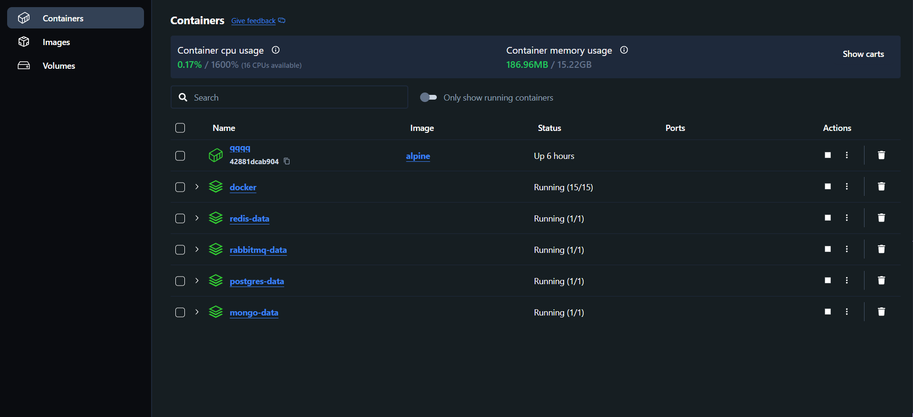
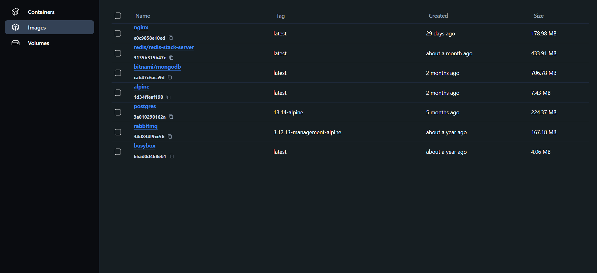
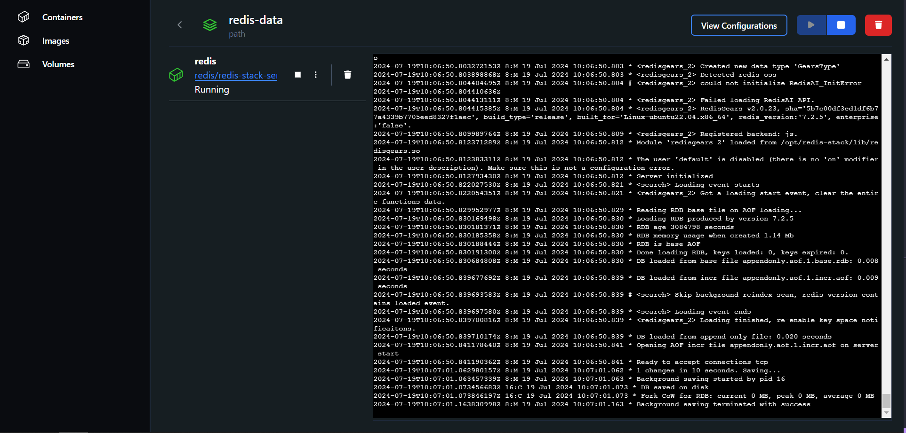
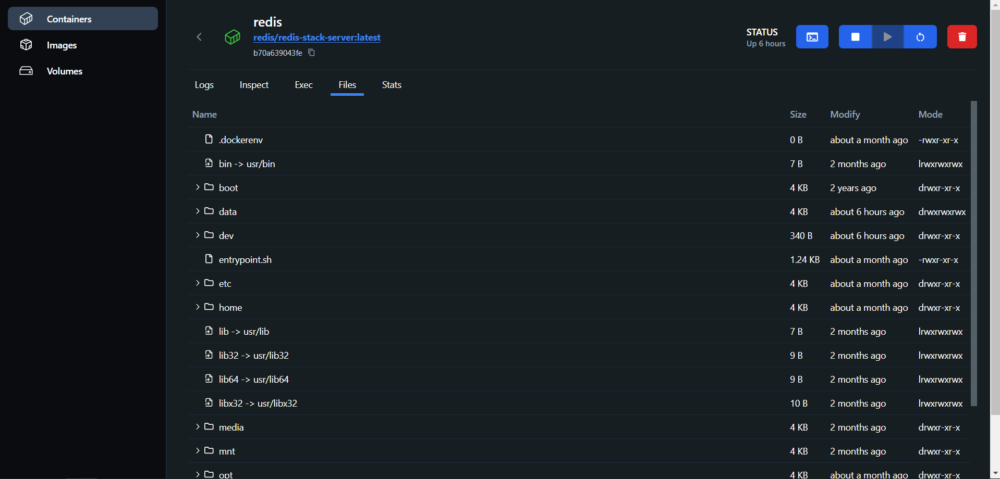
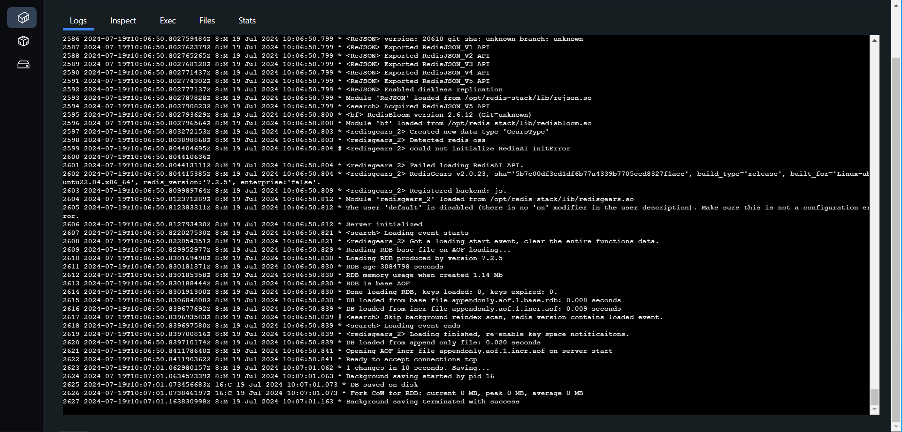

# Docker Desktop Application

This repository contains a Docker Desktop application built with React and Nestjs.

## Table of Contents

- [Introduction](#introduction)
- [Images](#images)
- [Prerequisites](#prerequisites)
- [Installation](#installation)

## Introduction

This app is very close to the real [Docker Desktop](https://www.docker.com/products/docker-desktop/) application. Uses React for the frontend and Nestjs for the backend.

## Images







## Prerequisites

Make sure you have the following installed:

- [Docker](https://www.docker.com/get-started)

## Installation

Clone the repository:

```bash
git clone https://github.com/virtueer/docker-desktop
cd docker-desktop
```

Build image:

```bash
# The port can be changed, but the last slash should not be deleted
docker build -t docker-desktop --build-arg VITE_API_BASE_URL=http://localhost:3004/ .
```

Run the container: <br/>

```bash
# The 3004 port must be the same as the port in the previous step
docker run --name docker-desktop -v /var/run/docker.sock:/var/run/docker.sock -p 3004:3000 -d docker-desktop
```

Visit url: http://localhost:3004/
